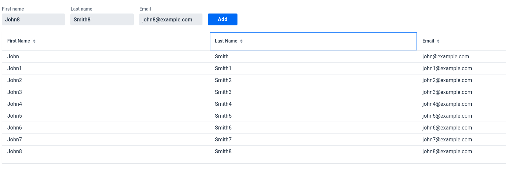

# Java Web App
[](https://github.com/a-dubaj/JavaWebApp/actions/workflows/maven.yml)

## Table of contents
* [General info](#general-info)
* [Technologies](#technologies)
* [Setup](#setup)

## General info
Base Java Vaadin Framework Web application.

## Technologies
Project is created with:
* Java
* JDK 18.0
* Vaadin Flow framework
* Spring

## Setup
To run this project:

```
mvn clean -X install
```

